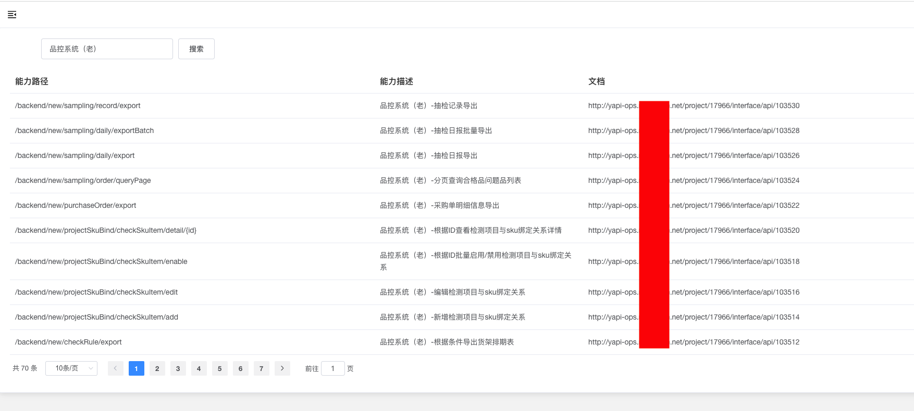

# 1.什么是ark-service-directory？
&emsp;&emsp;ark-service-directory是ark系列框架中的服务目录框架，目前是负责服务目录框架中的<b>文档api部分</b>的框架。<br/>
&emsp;&emsp;什么是服务目录？<br/>
&emsp;&emsp;服务化的本质是拆分，原来的单体应用被拆成了各种大大小小服务集群，并被分散到网络的各个节点，由不同的团队负责。在这个离散化的大背景下，整个研发团队遭遇一系列新的问题和挑战：<br/>
- 集群环境中我们在微服务场景下你如何快速定位问题出在哪？
- 整个集群的调用关系是什么样的？
- 如何梳理？合理不合理？
- 整个集群的性能瓶颈在哪？
- 团队被拆分了，团队之间如何高效的协作？
- 系统被拆分了，功能被分散到远程节点，如何做调试？
- 分布式架构下的数据一致性如何保障？<br/>
服务目录则是主要针对分布式服务框架，微服务，处理服务调用之间的关系，服务发布和发现（谁是提供者，谁是消费者，要注册到哪里），出了故障谁调用谁，服务的出入参数都有哪些约束，如何保证服务的质量，如何服务限流降级和熔断，怎么让服务受到监控，以提高服务的效能。<br>
  <br>
  
# 2.ark-service-directory解决了什么问题？
&emsp;&emsp;服务目录用于以上服务化过程中产生的各种问题，服务目录价值如下：
- 1.能力沉淀，透明，可视化
- 2.业务能力统一管控
- 3.提供多场景优质能力，帮助开发者提升效率
- 4.零售开放平台，零售开发者生态--终局
- 5.微服务管控
# 3.ark-service-directory的使用场景
- http服务
- dubbo服务
- http+dubbo服务


# 5.ark-service-directory框架如何使用？
添加ark-service-directory的包依赖后，在http controller或者dubbo service上加注解即可。
```
<dependency>
    <groupId>com.ark.service.directory</groupId>
    <artifactId>service-api-docs-core</artifactId>
    <version>1.0</version>
</dependency>


@ApiDoc 方法注解说明
Package: com.ark.service.apidocs.annotations.annotations
•接口名称（@ApiDoc.value）： 系统名称—接口简称
•接口备注描述（@ApiDoc.description）: 详细能力描述，完整的描述接口提供的能力信息即可
•接口返回对象描述（@ApiDoc.responseClassDescription）: 返回对象的详细内容描述

@RequestParam 参数注解说明
Package: com.ark.service.apidocs.annotations.annotations
1.方法入参注解
•参数名称（@RequestParam.value）: 参数入参名称，当前无意义，可置空
•参数描述（@RequestParam.description）: 详细描述参数作用，特殊说明等
•参数是否必填（@RequestParam.required）:  true 必填 ， false 非必填
2.入参Bean对象属性注解，可应用于入参Bean和出参Bean
•参数描述（@RequestParam.description）: 详细描述参数作用，特殊说明等
•参数是否必填（@RequestParam.required）:  true 必填 ， false 非必填
•默认值（@RequestParam.defaultValue）:  服务端默认值

@ResponseProperty 返回对象参数属性注解说明
Package: com.ark.service.apidocs.annotations.annotations
参数描述（@ResponseProperty.value）: 返回参数的详细描述

@ApiModule 实现类注解说明
Package: com.ark.service.apidocs.annotations.annotations
•类描述（@ApiModule.value）:  dubbo服务类的整体能力描述
•dubbo接口（@ApiModule.apiInterface）：dubbo对外开放服务的接口类

@ApiDoc 方法注解说明
Package: com.ark.service.apidocs.annotations.annotations
•方法名称（@ApiDoc.value）:  方法提供能力的接口名称
•方法描述（@ApiDoc.description）：方法提供能力接口的详细描述
•返回类描述（@ApiDoc.responseClassDescription）: 接口能力返回数据的描述信息

@RequestParam 参数注解说明，同http用法一样
Package: com.ark.service.apidocs.annotations.annotations
1.方法入参注解
•参数名称（@RequestParam.value）: 参数入参名称，置空字符串即可
•参数描述（@RequestParam.description）: 详细描述参数作用，特殊说明等
•参数是否必填（@RequestParam.required）:  true 必填 ， false 非必填


2.入参Bean对象属性注解，可应用于入参Bean和出参Bean
•参数描述（@RequestParam.description）: 详细描述参数作用，特殊说明等
•参数是否必填（@RequestParam.required）:  true 必填 ， false 非必填
•默认值（@RequestParam.defaultValue）:  服务端默认值


@ResponseProperty 返回对象参数属性注解说明，同http用法一样
Package: com.ark.service.apidocs.annotations.annotations
•参数描述（@ResponseProperty.value）: 返回参数的详细描述

```

